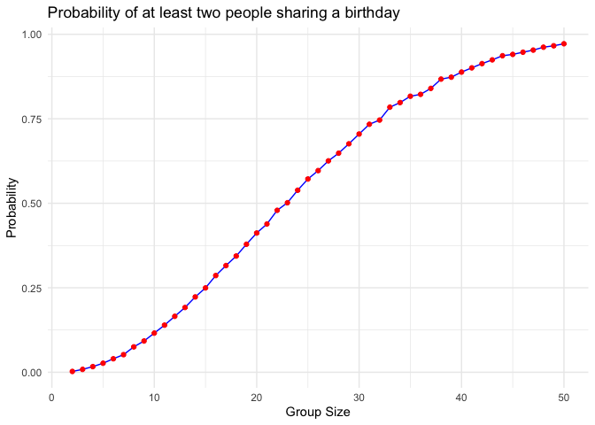
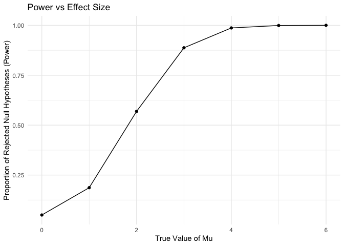
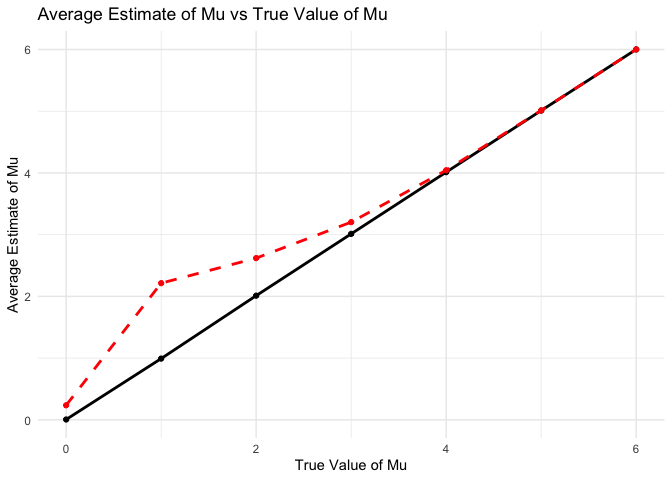
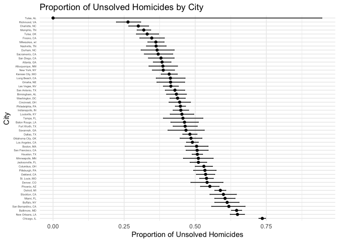

p8105_hw5_mz3084
================
Meitong Zhou
2024-11-12

``` r
library(tidyverse)
```

    ## ── Attaching core tidyverse packages ──────────────────────── tidyverse 2.0.0 ──
    ## ✔ dplyr     1.1.4     ✔ readr     2.1.5
    ## ✔ forcats   1.0.0     ✔ stringr   1.5.1
    ## ✔ ggplot2   3.5.1     ✔ tibble    3.2.1
    ## ✔ lubridate 1.9.3     ✔ tidyr     1.3.1
    ## ✔ purrr     1.0.2     
    ## ── Conflicts ────────────────────────────────────────── tidyverse_conflicts() ──
    ## ✖ dplyr::filter() masks stats::filter()
    ## ✖ dplyr::lag()    masks stats::lag()
    ## ℹ Use the conflicted package (<http://conflicted.r-lib.org/>) to force all conflicts to become errors

### Q1

``` r
birthday_function = function(n) {
  birthdays = sample(1:365, n, replace = TRUE)
  any(duplicated(birthdays))
}
```

``` r
# check the function with a 10 people group.
birthday_function(10)
```

    ## [1] FALSE

``` r
# check the function with a 40 people group.
birthday_function(40)
```

    ## [1] TRUE

``` r
set.seed(1)  # Set a seed for reproducibility
num_simulations = 10000  # Number of simulations per group size
group_sizes = 2:50  # Range of group sizes to test

results = sapply(group_sizes, function(n) {
  mean(replicate(num_simulations, birthday_function(n)))
})
results_df = data.frame(group_size = group_sizes, probability = results)
```

``` r
library(ggplot2)

ggplot(results_df, aes(x = group_size, y = probability)) +
  geom_line(color = "blue") +
  geom_point(color = "red") +
  labs(
    title = "Probability of at least two people sharing a birthday",
    x = "Group Size",
    y = "Probability"
  ) +
  theme_minimal()
```

<!-- -->

The resulting plot will show that 1. For small group sizes, the
probability is low. 2. Around a group size of 23, the probability
reaches approximately 50%. This is known as the “birthday paradox,”
where a relatively small group has a surprisingly high chance of a
shared birthday. 3. As the group size approaches 50, the probability
becomes very close to 1, indicating that it’s almost certain that at
least two people in the room share a birthday.

### Q2

``` r
library(broom)
```

``` r
n = 30        # sample size
sigma = 5     # standard deviation
alpha = 0.05  # significance level
mu_values = c(0, 1, 2, 3, 4, 5, 6)  # different values of true mean

# Initialize lists to store results
results = list()
```

``` r
for (mu in mu_values) {
  simulations = replicate(5000, rnorm(n, mean = mu, sd = sigma), simplify = FALSE)
  
  #t-test
  test_results = lapply(simulations, function(x) {
    test = t.test(x, mu = 0)    # test H0: mu = 0 
    broom::tidy(test)     
  })
  
 # Combine the result into data frame
  results[[as.character(mu)]] = do.call(rbind, test_results)
}

for (mu in names(results)) {
  cat("Results for mu =", mu, "\n")
  print(head(results[[mu]]))  
  cat("\n")
  return(results)
}
```

    ## Results for mu = 0 
    ## # A tibble: 6 × 8
    ##   estimate statistic p.value parameter conf.low conf.high method     alternative
    ##      <dbl>     <dbl>   <dbl>     <dbl>    <dbl>     <dbl> <chr>      <chr>      
    ## 1   -1.62     -2.00   0.0545        29    -3.26    0.0331 One Sampl… two.sided  
    ## 2   -0.542    -0.575  0.569         29    -2.47    1.38   One Sampl… two.sided  
    ## 3   -0.278    -0.299  0.767         29    -2.18    1.63   One Sampl… two.sided  
    ## 4   -0.303    -0.345  0.733         29    -2.10    1.49   One Sampl… two.sided  
    ## 5    0.406     0.477  0.637         29    -1.34    2.15   One Sampl… two.sided  
    ## 6    0.147     0.151  0.881         29    -1.85    2.14   One Sampl… two.sided

``` r
all_results = bind_rows(lapply(names(results), function(mu) {
  df = results[[mu]]
  df$true_mu = as.numeric(mu)
  return(df)
}), .id = "mu")
# Calculate every mu-value
power_data = all_results |>
  group_by(true_mu) |>
  summarise(power = mean(p.value < alpha))

ggplot(power_data, aes(x = true_mu, y = power)) +
  geom_line() +
  geom_point() +
  labs(title = "Power vs Effect Size",
       x = "True Value of Mu",
       y = "Proportion of Rejected Null Hypotheses (Power)") +
  theme_minimal()
```

<!-- -->

As the value of mu increases, the power rises, showing that larger
effect sizes increase the likelihood of rejecting the null hypothesis.

``` r
# Calculate average mu
estimate_data = all_results |>
  group_by(true_mu) |>
  summarise(
    avg_estimate = mean(estimate),
    avg_estimate_rejected = mean(estimate[p.value < alpha])
  )


ggplot(estimate_data, aes(x = true_mu)) +
  geom_line(aes(y = avg_estimate), color = "black", linetype = "solid", linewidth = 1) +
  geom_point(aes(y = avg_estimate), color = "black") +
  geom_line(aes(y = avg_estimate_rejected), color = "red", linetype = "dashed", linewidth = 1) +
  geom_point(aes(y = avg_estimate_rejected), color = "red") +
  labs(title = "Average Estimate of Mu vs True Value of Mu",
       x = "True Value of Mu",
       y = "Average Estimate of Mu") +
  theme_minimal()
```

<!-- -->

An improvement in estimation accuracy with larger values of mu.

### Q3

``` r
homicides = read.csv("https://raw.githubusercontent.com/washingtonpost/data-homicides/refs/heads/master/homicide-data.csv")

# examine the first few rows of the data to understand the structure
head(homicides)
```

    ##          uid reported_date victim_last victim_first victim_race victim_age
    ## 1 Alb-000001      20100504      GARCIA         JUAN    Hispanic         78
    ## 2 Alb-000002      20100216     MONTOYA      CAMERON    Hispanic         17
    ## 3 Alb-000003      20100601 SATTERFIELD      VIVIANA       White         15
    ## 4 Alb-000004      20100101    MENDIOLA       CARLOS    Hispanic         32
    ## 5 Alb-000005      20100102        MULA       VIVIAN       White         72
    ## 6 Alb-000006      20100126        BOOK    GERALDINE       White         91
    ##   victim_sex        city state      lat       lon           disposition
    ## 1       Male Albuquerque    NM 35.09579 -106.5386 Closed without arrest
    ## 2       Male Albuquerque    NM 35.05681 -106.7153      Closed by arrest
    ## 3     Female Albuquerque    NM 35.08609 -106.6956 Closed without arrest
    ## 4       Male Albuquerque    NM 35.07849 -106.5561      Closed by arrest
    ## 5     Female Albuquerque    NM 35.13036 -106.5810 Closed without arrest
    ## 6     Female Albuquerque    NM 35.15111 -106.5378        Open/No arrest

``` r
str(homicides)
```

    ## 'data.frame':    52179 obs. of  12 variables:
    ##  $ uid          : chr  "Alb-000001" "Alb-000002" "Alb-000003" "Alb-000004" ...
    ##  $ reported_date: int  20100504 20100216 20100601 20100101 20100102 20100126 20100127 20100127 20100130 20100210 ...
    ##  $ victim_last  : chr  "GARCIA" "MONTOYA" "SATTERFIELD" "MENDIOLA" ...
    ##  $ victim_first : chr  "JUAN" "CAMERON" "VIVIANA" "CARLOS" ...
    ##  $ victim_race  : chr  "Hispanic" "Hispanic" "White" "Hispanic" ...
    ##  $ victim_age   : chr  "78" "17" "15" "32" ...
    ##  $ victim_sex   : chr  "Male" "Male" "Female" "Male" ...
    ##  $ city         : chr  "Albuquerque" "Albuquerque" "Albuquerque" "Albuquerque" ...
    ##  $ state        : chr  "NM" "NM" "NM" "NM" ...
    ##  $ lat          : num  35.1 35.1 35.1 35.1 35.1 ...
    ##  $ lon          : num  -107 -107 -107 -107 -107 ...
    ##  $ disposition  : chr  "Closed without arrest" "Closed by arrest" "Closed without arrest" "Closed by arrest" ...

``` r
homicides = homicides |>
  mutate(city_state = paste(city, state, sep = ", ")) |>
  group_by(city_state) |>
  summarize(
    total_homicides = n(),
    unsolved_homicides = sum(disposition %in% c("Closed without arrest", "Open/No arrest"))
  )
```

``` r
# filter for Baltimore, MD
baltimore_data = homicides |>
  filter(city_state == "Baltimore, MD")

# Conduct proportion test
baltimore_prop_test = prop.test(
  x = baltimore_data$unsolved_homicides,
  n = baltimore_data$total_homicides
)

# Tidy the output and extract relevant information
baltimore_summary = broom::tidy(baltimore_prop_test) %>%
  select(estimate, conf.low, conf.high)
baltimore_summary
```

    ## # A tibble: 1 × 3
    ##   estimate conf.low conf.high
    ##      <dbl>    <dbl>     <dbl>
    ## 1    0.646    0.628     0.663

``` r
city_proportions = homicides |>
  mutate(
    prop_test = map2(unsolved_homicides, total_homicides, ~ prop.test(.x, .y)),
    tidy_test = map(prop_test, broom::tidy)
  ) |>
  unnest(tidy_test) |>
  select(city_state, estimate, conf.low, conf.high)
```

    ## Warning: There was 1 warning in `mutate()`.
    ## ℹ In argument: `prop_test = map2(unsolved_homicides, total_homicides,
    ##   ~prop.test(.x, .y))`.
    ## Caused by warning in `prop.test()`:
    ## ! Chi-squared approximation may be incorrect

``` r
print(city_proportions)
```

    ## # A tibble: 51 × 4
    ##    city_state      estimate conf.low conf.high
    ##    <chr>              <dbl>    <dbl>     <dbl>
    ##  1 Albuquerque, NM    0.386    0.337     0.438
    ##  2 Atlanta, GA        0.383    0.353     0.415
    ##  3 Baltimore, MD      0.646    0.628     0.663
    ##  4 Baton Rouge, LA    0.462    0.414     0.511
    ##  5 Birmingham, AL     0.434    0.399     0.469
    ##  6 Boston, MA         0.505    0.465     0.545
    ##  7 Buffalo, NY        0.612    0.569     0.654
    ##  8 Charlotte, NC      0.300    0.266     0.336
    ##  9 Chicago, IL        0.736    0.724     0.747
    ## 10 Cincinnati, OH     0.445    0.408     0.483
    ## # ℹ 41 more rows

``` r
# Arrange cities by the proportion estimate
city_proportions = city_proportions |>
  arrange(desc(estimate)) |>
  mutate(city_state = factor(city_state, levels = unique(city_state)))

ggplot(city_proportions, aes(x = city_state, y = estimate)) +
  geom_point() +
  geom_errorbar(aes(ymin = conf.low, ymax = conf.high), width = 0.2) +
  coord_flip() +
  labs(
    title = "Proportion of Unsolved Homicides by City",
    x = "City",
    y = "Proportion of Unsolved Homicides"
  ) +
  theme_minimal() +
  theme(
    axis.text.y = element_text(size = 4)      # Adjust the text size of y-axis.
  )
```

<!-- -->
Some cities like Chicago, IL, Baltimore, MD, and New Orleans, LA have
particularly high proportions of unsolved cases. However, some cities,
such as Tulsa, AL, has a relatively lower rate of unsolved homicides.
